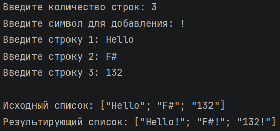
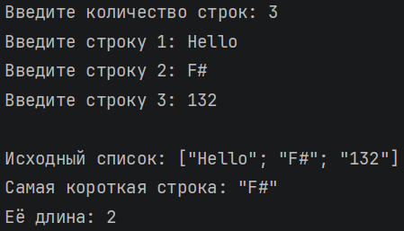
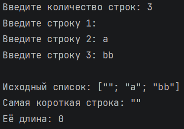

# Никифоров Егор КМБ\_2 Лабораторная №3

## Задание 1

### Текст задачи

На основе данной последовательности строк получить новую последовательность, где к каждой строке в конце дописан заданный символ.

### Алгоритм решения

1\. Запросить у пользователя количество строк (целое положительное число) с помощью рекурсивной функции readInt, которая повторяет запрос до получения корректного значения.

2\. Ввести указанное количество строк, используя последовательность (seq). Каждая строка запрашивается по мере обхода последовательности.

3\. Запросить символ для добавления с проверкой, что введён ровно один символ (функция readChar).

4\. Применить к последовательности строк функцию Seq.map: для каждого элемента выполняется добавление символа в конец (простое склеивание строк).

5\. Вывести исходную последовательность (преобразовав в список для наглядности) и результирующую последовательность.

### Тестирование

## Задание 2

### Текст задачи

Последовательность содержит строки. Найти самую короткую строку.

### Алгоритм решения

1. Запросить у пользователя количество строк (целое положительное число) с помощью функции readInt.

2. Ввести указанное количество строк как последовательность (seq).

3. С помощью Seq.fold найти строку наименьшей длины:

    Начальное значение – первый элемент последовательности (гарантированно существует, так как количество строк > 0).

    Функция-накопитель сравнивает длину текущей строки с длиной накопленной и сохраняет более короткую.

4. Вывести исходную последовательность (преобразовав в список) и найденную строку с её длиной.

### Тестирование

## Задание 3

### Текст задачи

Вывести последний по алфавиту файл в указанном каталоге.

### Алгоритм решения

1. Запросить у пользователя путь к каталогу.

2. Проверить существование каталога с помощью Directory.Exists. Если каталога нет – вывести сообщение и завершить работу.

3. Получить последовательность полных имён файлов через Directory.EnumerateFiles. С помощью Seq.map преобразовать её в последовательность только имён файлов (без пути), используя Path.GetFileName.

4. Проверить, есть ли файлы в каталоге, с помощью Seq.isEmpty. Если файлов нет – вывести соответствующее сообщение.

5. Если файлы есть:

    Взять первый файл через Seq.head как начальное значение.

    С помощью Seq.fold обойти все файлы, сравнивая текущее имя с накопленным. Для сравнения используется String.Compare с параметром StringComparison.Ordinal, чтобы обеспечить простой лексикографический порядок без учёта региональных настроек.

    Если очередной файл оказывается больше (позже по алфавиту), он становится новым накопленным значением.

6. Вывести найденный файл.

### Тестирование

