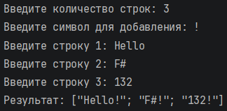
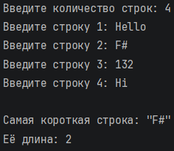
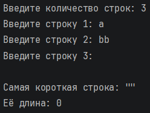
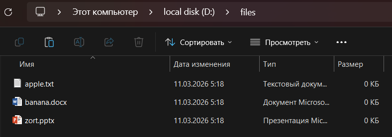
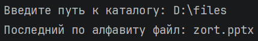

# Никифоров Егор КМБ\_2 Лабораторная №3

## Задание 1

### Текст задачи

На основе данной последовательности строк получить новую последовательность, где к каждой строке в конце дописан заданный символ.

### Алгоритм решения

1. Запросить у пользователя количество строк с помощью рекурсивной функции readInt, которая проверяет, что введено целое положительное число, и повторяет запрос при ошибке.

2. Запросить символ для добавления с помощью рекурсивной функции readChar, которая проверяет, что введена строка длиной ровно один символ.

3. Создать ленивую последовательность строк readStrings с использованием seq. При каждом обращении к элементу последовательности выводится приглашение и считывается строка с клавиатуры.

4. Применить к полученной последовательности функцию Seq.map, передавая ей лямбда-выражение fun s -> s + string symbol, которое добавляет символ в конец каждой строки.

5. Для вывода результата последовательность преобразуется в список с помощью Seq.toList, чтобы содержимое отобразилось в консоли. Сама обработка данных остаётся в рамках последовательностей.

### Тестирование

## Задание 2

### Текст задачи

Последовательность содержит строки. Найти самую короткую строку.

### Алгоритм решения

1. Запросить у пользователя количество строк с помощью функции readInt.

2. Создать ленивую последовательность строк readStrings.

3. Применить Seq.fold к последовательности, используя начальное состояние None (тип Option<string>). Функция-накопитель:

    Если текущее состояние None (первая строка), возвращает Some с этой строкой.

    Если состояние Some prev, сравнивает длину текущей строки s с длиной prev. Если s короче, новым состоянием становится Some s, иначе остаётся Some prev.

4. После завершения свёртки получаем Some с самой короткой строкой (так как последовательность не пуста). Извлекаем значение с помощью свойства .Value.

5. Выводим найденную строку и её длину.

### Тестирование

## Задание 3

### Текст задачи

Вывести последний по алфавиту файл в указанном каталоге.

### Алгоритм решения

1. Запросить у пользователя путь к каталогу.

2. Проверить существование каталога с помощью Directory.Exists. Если каталога нет – вывести сообщение и завершить работу.

3. Получить последовательность полных имён файлов через Directory.EnumerateFiles. С помощью Seq.map преобразовать её в последовательность только имён файлов (без пути), используя Path.GetFileName.

4. Проверить, есть ли файлы в каталоге, с помощью Seq.isEmpty. Если файлов нет – вывести соответствующее сообщение.

5. Если файлы есть:

    Взять первый файл через Seq.head как начальное значение.

    С помощью Seq.fold обойти все файлы, сравнивая текущее имя с накопленным. Для сравнения используется String.Compare с параметром StringComparison.Ordinal, чтобы обеспечить простой лексикографический порядок без учёта региональных настроек.

    Если очередной файл оказывается больше (позже по алфавиту), он становится новым накопленным значением.

6. Вывести найденный файл.

### Тестирование

